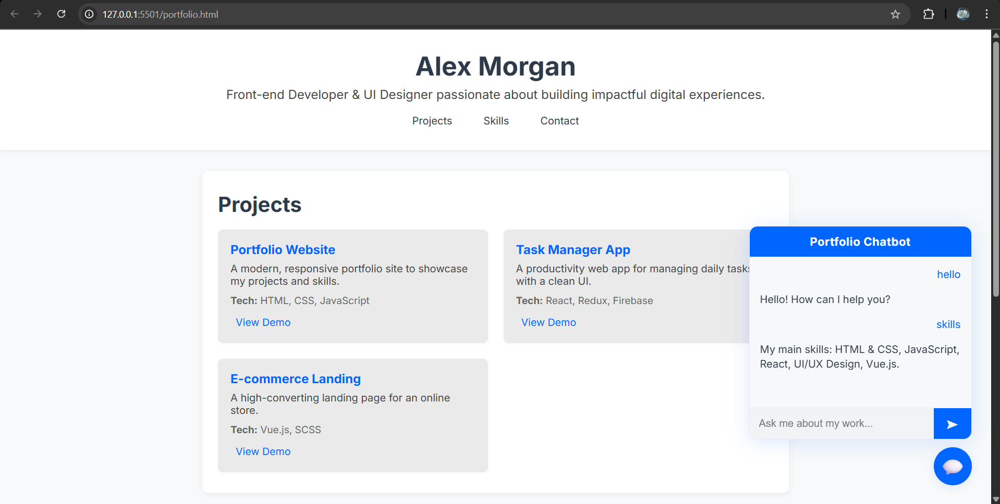

<h1>💼 Professional Portfolio with Chatbot</h1>

A clean, responsive, and modern portfolio website built with HTML, CSS, and JavaScript. It features a project showcase, animated skills, contact section, and a smart chatbot that answers questions about your work.

<h2>📸 Preview</h2>

<em>You can see the bot is functional</em>

<h2>🚀 Features</h2>
<ul>
  <li>✅ Responsive design</li>
  <li>✅ Interactive chatbot for FAQs</li>
  <li>✅ Animated skill bars</li>
  <li>✅ Project showcase with technologies used</li>
  <li>✅ Contact info with email & LinkedIn</li>
</ul>

<h2>🛠️ Tech Stack</h2>
<ul>
  <li><strong>HTML5</strong></li>
  <li><strong>CSS3</strong></li>
  <li><strong>JavaScript (Vanilla)</strong></li>
  <li><strong>Google Fonts (Inter)</strong></li>
</ul>

<h2>📁 Folder Structure</h2>
<pre>
📁 portfolio-chatbot
├── portfolio1.html
├── 📁 Resources
├──         └── image.png
└── README.md
</pre>

<h2>📥 Setup Instructions</h2>
<ol>
  <li>Clone the repository: 
    <code>git clone https://github.com/yourusername/portfolio-chatbot.git</code>
  </li>
  <li>Open <code>portfolio1.html</code> in your browser</li>
  <li>Customize profile data in the JavaScript <code>data</code> object</li>
</ol>

<h2>🧠 Chatbot Responses</h2>
<ul>
  <li><strong>Name Queries:</strong> "What’s your name?" → Responds with name</li>
  <li><strong>Skills:</strong> "What are your skills?" → Lists technical skills</li>
  <li><strong>Projects:</strong> "Show your projects" → Lists project names</li>
  <li><strong>Contact:</strong> "How can I contact you?" → Email or LinkedIn link</li>
  <li><strong>Greetings:</strong> "Hi", "Hello" → Friendly reply</li>
</ul>

<h2>✍️ Example Customization</h2>

Edit this object in <code>&lt;script&gt;</code> tag of <code>index.html</code>:

<pre>
const data = {
  profile: {
    name: "Your Name",
    bio: "Brief description"
  },
  projects: [
    {
      title: "Project Name",
      description: "What it does",
      tech: ["HTML", "CSS", "JS"],
      demo: "#"
    }
  ],
  skills: {
    "HTML": 90,
    "CSS": 85
  },
  contact: {
    email: "you@example.com",
    linkedin: "https://linkedin.com/in/saurya11253v"
  }
};
</pre>

<h2>🌐 Live Demo</h2>

🔗 <a href="https://your-deployed-url.com" target="_blank">View Live Portfolio</a>

<h2>📄 License</h2>

This project is licensed under the <strong>MIT License</strong>.

<h2>🙋‍♂️ Author</h2>
<ul>
  <li><strong>Alex Morgan</strong></li>
  <li>Email: <a href="mailto:alex.morgan@email.com">alex.morgan@email.com</a></li>
  <li>LinkedIn: <a href="https://linkedin.com/in/alexmorgan" target="_blank">linkedin.com/in/alexmorgan</a></li>
</ul>
